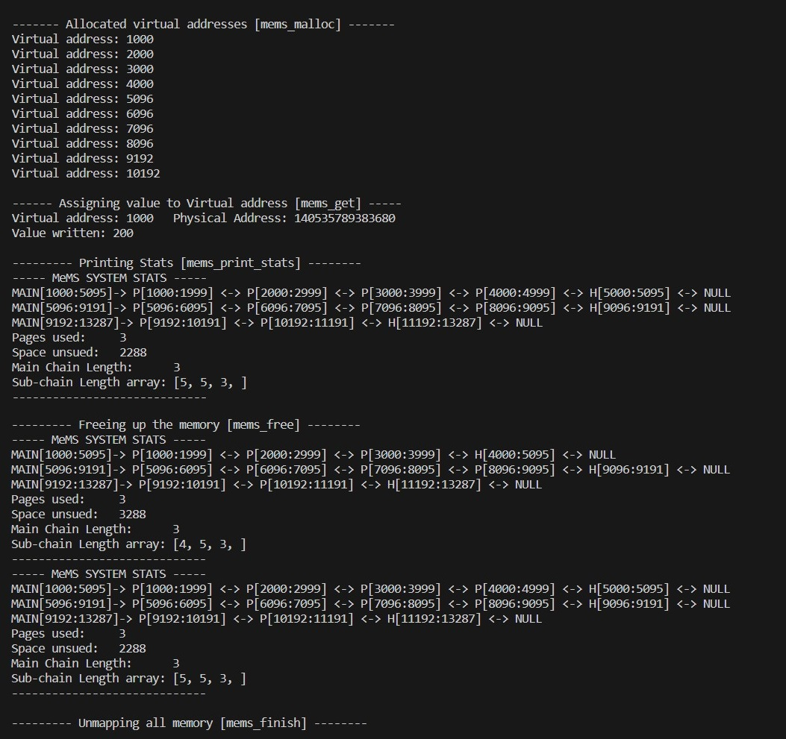

# MeMS: Memory Management System [CSE231 OS Assignment 3]
[Documentation](https://docs.google.com/document/d/1Gs9kC3187lLrinvK1SueTc8dHCJ0QP43eRlrCRlXiCY/edit?usp=sharing)
---

### How to run the exmaple.c
After implementing functions in mems.h follow the below steps to run example.c file
```
$ make
$ ./example
```
---
### Format of mems_mems_print_stats
* For every Subchain in the free list print the data as follows 
```
MAIN[starting_mems_vitual_address:ending_mems_vitual_address] -> <HOLE or PROCESS>[starting_mems_vitual_address:ending_mems_vitual_address] <-> ..... <-> NULL
```
* After printing the whole freelist print the following stats
```
Page used: <Total Pages used by the user>
Space unused: <Total space mapped but not used by user>
Main Chain Length: <Length of the main chain>
Sub-chain Length array: <Array denoting the length of the subchains>
```
* Analyse the output of the example.c file below to get a better understanding of the output
---
### Example Output
PAGE_SIZE= 4096 Bytes

Starting MeMS Virtual Address= 1000




Sure, here's a Markdown (.md) README file that explains the logic and usage of the functions in the provided code:

# MeMS (Memory Management System) By Pranav & Omansh

MeMS is a simple memory management system implemented in C. It offers memory allocation and deallocation functionalities, similar to `malloc` and `free` in standard C libraries. This README provides an overview of the MeMS system and explains the functions within it.

## Table of Contents
- [MeMS Overview](#mems-overview)
- [Functions](#functions)
  - [mems_init](#mems_init)
  - [mems_finish](#mems_finish)
  - [mems_malloc](#mems_malloc)
  - [mems_print_stats](#mems_print_stats)
  - [mems_get](#mems_get)
  - [mems_free](#mems_free)

## MeMS Overview

MeMS (Memory Management System) is designed to manage memory allocations efficiently. It employs a hierarchical data structure with the following components:

- *Main Chain Nodes*: These nodes represent large memory chunks. Each node is further divided into sub-chains.

- *Sub Chain Nodes*: Sub-chains represent smaller segments within main nodes. Sub-chains can be of two types: "HOLE" or "PROCESS."

- *HOLE*: Represents free memory segments available for allocation.
- *PROCESS*: Represents allocated memory segments.

## Functions

### `mems_init()`

This function initializes the MeMS system. It sets up the main chain and initializes necessary variables.

### `mems_finish()`

This function is called at the end of the MeMS system to clean up and unmap any allocated memory.

### `mems_malloc(size_t size)`

- Allocates memory of the specified size.
- Reuses a segment from the free list if available.
- Uses the `mmap` system call to allocate more memory on the heap if necessary.
- Also updates the free list to reuse unused memory from mappings.

### `mems_print_stats()`

Prints statistics about the MeMS system, including:
- The number of pages utilized by `mems_malloc`.
- The amount of unused memory (memory in the free list not used).
- Details about each node in the main chain and each segment (PROCESS or HOLE) in the sub-chain.

### `mems_get(void* v_ptr)`

- Returns the MeMS physical address mapped to the provided MeMS virtual address (`v_ptr`).

### `mems_free(void *v_ptr)`

- Frees up memory pointed to by the virtual address (`v_ptr`) and adds it to the free list.
- This function marks the segment as "HOLE" in the MeMS system.
- It also checks for contiguous holes and merges them.

Please note that this MeMS system is a simplified implementation for educational purposes. It may not be suitable for production use as it lacks some critical features like proper error handling, thread safety, and efficient memory management algorithms. Also, the code provided has comments that can guide you through the implementation details.

Make sure to consult the provided comments in the code for further understanding and usage of these functions.